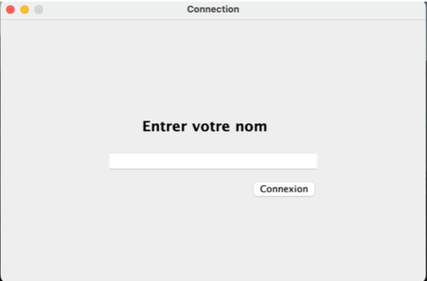
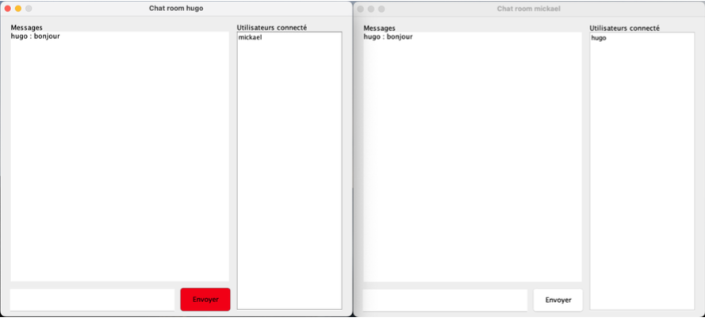

# Java Socket Chat
## Concept
Il fallait concevoir un programme client-server pour pouvoir faire une application de chat multi-utilisateurs. Nous devions créer notre propre protocole de communication donc faire le format des différents paquets de communications. De plus, il fallait faire la gestion de la communication entre les différents clients, puisqu'un client peut envoyer un message à seulement certains clients. Donc gestion des threads du côté du server.

## Média(s)

### Login

### Chat

## Technologies
- Java
- Java Swing
- Design Patterns (Observer)